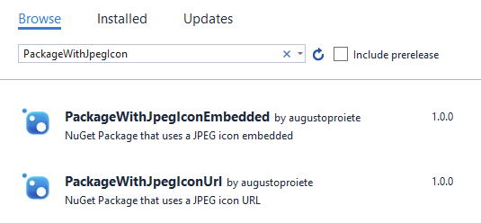
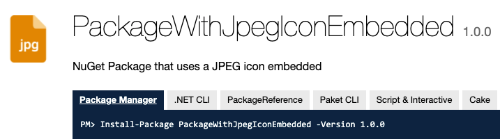
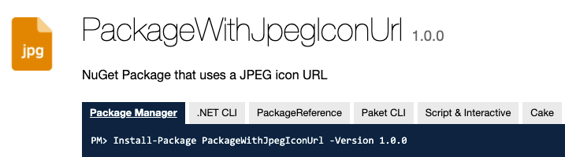

## Visual Studio does not display JPEG icons of NuGet packages

From the [nuspec documentation](https://docs.microsoft.com/en-us/nuget/reference/nuspec#icon) (emphasis mine):

>
> ### icon
> It is a path to an image file within the package, often shown in UIs like nuget.org as the package icon. Image file size is limited to 1 MB. **Supported file formats include JPEG and PNG**. We recommend an image resolution of 128x128.
>
However, as of Visual Studio 2019 (16.10.4) JPEG icons are not being displayed in the NuGet Package Manager UI:

### Repro

I created two example NuGet packages using JPEG icons:

#### Embedded Icon

https://www.nuget.org/packages/PackageWithJpegIconEmbedded/

#### URL Icon

https://www.nuget.org/packages/PackageWithJpegIconUrl/

---

Related: https://github.com/NuGet/Home/issues/8189#issuecomment-894865050
